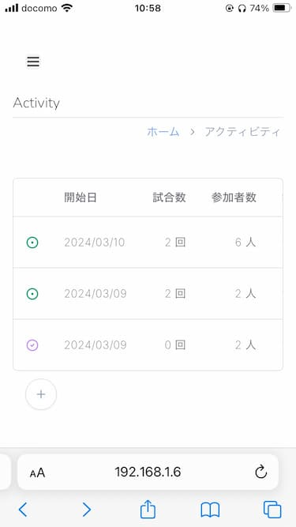
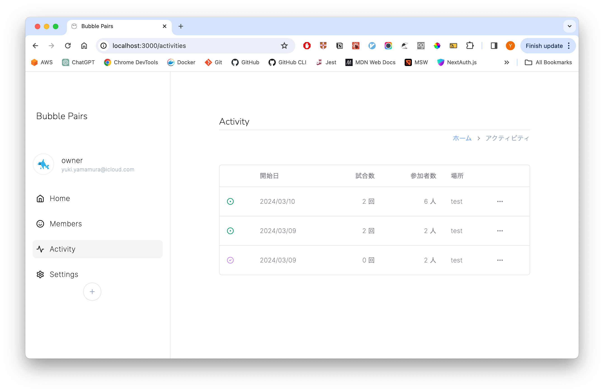

# Bubble Pairs

Bubble Pairs offers the new way to make a match for badminton games. This is simple and easy to use.

demo site: https://bubblepairs.com

## Adapted design for mobile

### Mobile



### PC



## Get started

If you want to run the app on your machine, there are some of the requirements.

- Docker
- An email sending service like [Mailtrap](https://mailtrap.io/) or [Amazon SES](https://aws.amazon.com/ses/)

And you have to do the following steps:

1. Clone this repository.
2. Install the dependencies.

```shell
npm install
```

3. Run Docker.

```shell
docker-compose up
```

4. Copy `.env.template` and configure environment variables.

```shell
copy .env.template .env
```

5. Run the development server

```shell
npm run dev
```

That it! Now, you can see the page through the browser (http://localhost:3000).
